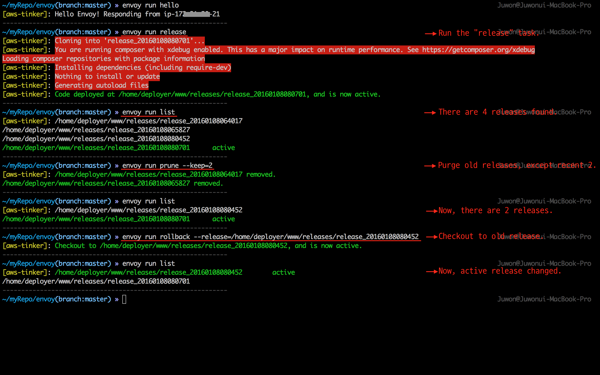

# Envoy Use Case Demo

## What is this? What for?

[Envoy is a SSH task runner](https://laravel.com/docs/envoy) written in PHP language. Which means you can automate a predefined server job in your local computer, without having to manually ssh in to the server and run the bunch of shell command. e.g. `$ envoy run release`

**Was born in Laravel world, but can be applicable to any project (framework or language agnostic).** 

This repository is an example of an Envoy script (`envoy.blade.php`), that demos the usefulness and the powerfulness of the Envoy. 

## Demo scenario

Note that Envoy is not a deployment tool, such as capistrano or deployer, but can be used as such. Git neither is a deployment tool. 

In this example Envoy script, written for code deployment scenario in conjunction with Git, poses a strategy that lowers the headache of code deployment to the production server. By adopting this strategy, you can:

1.  achieve zero down time of the service.
2.  achieve zero conflict in production server.
3.  maintain release histories (by not overwriting the previous release).

To do that, the script takes `git clone` strategy rather than `git pull` or `git fetch`. Once the clone is done, the script symlinks the current clone to the document root of the web server.

This script may not fit your needs 100% though, I bet you get the idea what to do next.

## Try yourself !

#### **Step #1** Install `laravel/envoy` executable 

This is an one time process. We need the `envoy` executable.

```bash
# at your local computer

$ composer global require "laravel/envoy=~1.0"
$ envoy --version # Laravel Envoy version x.x.x
```

**`Note`** Make sure to place the `~/.composer/vendor/bin` directory in your `PATH` so the `envoy` executable is found when you run the `envoy` command in your terminal.

#### **Step #2** Download the recipe scripts

`envoy.blade.php` is a task definition file, and must be placed in every project.

```bash
# at your local computer

$ cd project
$ wget https://raw.githubusercontent.com/appkr/envoy/master/envoy.blade.php
```

#### **Step #3** Install keys

This process has nothing to do with Envoy, but required for this demo script to be working.

Considering the deployment process, servers must be able to talk to each other. On the local machine, you push the code to the version control server, then you would publish `$ envoy run release` task (task will propagated to the production server through the ssh). Then the production server clones the code from the version control server. In this scenario,

-   The local machine should have:
    - ssh private key to connect to the production server
    - ssh private key to connect to the version control server <sup>(1)</sup>
-   The production server shold have:
    - ssh public key to authenticate the local machine 
    - ssh private key to connect to the version control server (Can be same as <sup>(1)</sup>)
    
**`Note`** Before you run the first deployment using envoy, the production server has to know the github server. You can do it by ssh in to the production server and by issuing `$ ssh -T git@github.com`. See [this page](https://help.github.com/articles/generating-ssh-keys/).

#### **Step #4** Run the first envoy task

Edit your variables at `@server` and `@setup` section of `envoy.blade.php`.

```php
// envoy.blade.php

// ip address, domain, or alias. Whatever name you use to connect to the server via ssh.
@servers(['web' => 'deployer@aws-seoul-deploy'])

@setup
  $path = [
    'base' => '/home/deployer/web',
    // ...
  ];
@endsetup
```

Let's run the first ssh task.

```bash
# at your local computer

$ envoy run hello
# [your_server_hostname]: Hello Envoy! Responding from your_server_hostname
```

#### **Step #5** Customize your envoy script

Following Envoy tasks are predefined out of the box. Why not add or modify for yours?

-   `hello`
    : Check ssh connection
-   `release`
    : Publish new release
-   `list`
    : Show list of releases
-   `checkout`
    : Checkout to the given release (must provide `--release=/path/to/release`)
-   `prune`
    : Purge old releases (must provide `--keep=n`, where n is a number of release to keep)

For example,

```bash
# at your local computer
# after pushing new code to git ...

$ envoy run release
```

will produce the following (at server).

```bash
web
├── releases
│   └── release_YmdHis
│       ├── # other dirs or files
│       └── .env -> /home/deployer/web/shared/.env
├── shared
└── envoy.appkr.kr -> /home/deployer/web/releases/release_YmdHis
```

Where `web/releases` is housing of all releases, distinguished by directory name of `release_YmdHis`. `web/shared` is a shared resources that every release has to link to, like cache storage, user uploaded files, etc. `web/envoy.appkr.kr` is the active release symbolic linked to the document root of the web server.



## Side note

The following is the short explanation of this repository.

```bash
.
├── envoy.blade.php           # [Must] Envoy script
├── envoy.config.php.example  # [Optional] configuration. 
│                             # Useful when separating envoy.blade.php and its required variables.
└── scripts
    ├── provision.sh          # Script for server provision
    ├── officer.php           # PHP script that will do the clerical job of keeping the release history ledger 
    │                         #  in the server, and will be installed on the server while running any task.
    │                         #  (if one doesn't exist)
    └── serve.sh              # Script for setting nginx sites
# Not listed dir/files were laid there for the purpose of demo.
```

**`Note`** With `scripts/provision.sh`, `scripts/serve.sh` you can quickly provision a server and nginx sites. For usage, refer to each script.

## License

MIT


